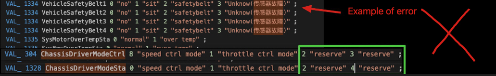

# Vehicle ROS Driver Generator

## Overview
This tool was inspired by the [Gen Vehicle Protocol Tool](https://github.com/ApolloAuto/apollo/tree/master/modules/tools/gen_vehicle_protocol) in [Apollo](https://github.com/ApolloAuto/apollo). We modified this tool for ROS/ROS2 driver generation according to the DBC file of vehicles.
## Tool Framework

- `gen.py` : main code, uses other libraries, create `pix_{car_type}_driver` and `pix_{car_type}_driver_msgs`
- `extract_dbc_meta.py`: decodes DBC file then creates yml file for easy use of canbus protocol
- `gen_msg_file.py`: generates msg ROS package, according to the yml file of canbus protocol
- `gen_protocols.py`: generates c++ header files and source files for canbus protocol, according to the yml file of cnabus protocol
- `gen_ros_node.py`:  generates the ROS nodes of `control_command` and `report_parser`
- `gen_config_file.py`:  generates `CMakeLists.txt` and `packages.xml` files

## HOW TO USE
> Notice: The names of CAN frames and the names of variables in CAN frames should be camel case like below.
```
BO_ 1330 SteerStaFb: 8 VCU
 SG_ ChassisSteerEnSta : 0|1@1+ (1,0) [0|1] ""  ACU
 SG_ ChassisSteerSlopover : 1|1@1+ (1,0) [0|1] ""  ACU
 SG_ ChassisSteerWorkMode : 2|2@1+ (1,0) [0|3] ""  ACU
 SG_ ChassisSteerModeFb : 4|4@1+ (1,0) [0|15] ""  VCU
 SG_ ChassisSteerAngleFb : 8|16@1- (1,0) [-500|500] "deg"  ACU
 SG_ ChassisSteerAngleRearFb : 24|16@1- (1,0) [-500|500] "deg"  ACU
 SG_ ChassisSteerAngleSpeedFb : 40|8@1+ (2,0) [0|500] "deg/s"  ACU
```
> Constants should not have renames and Chinese names in the dbc file, as shown in the following error example:



### 1. copy the DBC file of your vehicle to `config` folder, for example `pixmocing.dbc`, for example `pix_moving_conf.yml`

```yaml
dbc_file: pixmoving.dbc # DBC file
protocol_conf: pixmoving.yml # generated canbus protocol file
car_type: hooke # name of vehicle, if it is hooke, the generated packages should be 'pix_hooke_driver` and `pix_hooke_driver_msgs`
sender_list: [DriveCtrl, BrakeCtrl, SteerCtrl, VehicleCtrl, WheelCtrl] # name of CAN Frames that be sent to vehicle
sender: ACU # name of sender
black_list: []

output_dir: output # output directory
config_dir: config/ # config file directory

```
### 3. run `gen.py`
#### run code
```bash
python3 gen.py config/pixmoving_conf.yml
```

#### if success, you will see the output below

```bash
Extract car_type:HOOKE's protocol meta info to file: config/pixmoving.yml
Total parsed protocols: 15
Control protocols: 5
Report protocols: 10
Generating protocols
Generating canID node cpp
9
Generating canID Config file
['drive_ctrl', 'brake_ctrl', 'steer_ctrl', 'vehicle_ctrl', 'wheel_ctrl']
```

### 4. Auto-generated code
the structure of auto-generated code are shown below.

```bash
├── pix_hooke_driver
│   ├── CMakeLists.txt
│   ├── include
│   │   └── pix_hooke_driver
│   │       ├── Byte.hpp
│   │       ├── brake_ctrl.hpp
│   │       ├── brake_sta_fb.hpp
│   │       ├── chassis_wheel_angle_fb.hpp
│   │       ├── chassis_wheel_rpm_fb.hpp
│   │       ├── chassis_wheel_tire_press_fb.hpp
│   │       ├── control_command.hpp
│   │       ├── drive_ctrl.hpp
│   │       ├── drive_sta_fb.hpp
│   │       ├── power_sta_fb.hpp
│   │       ├── report_parser.hpp
│   │       ├── steer_ctrl.hpp
│   │       ├── steer_sta_fb.hpp
│   │       ├── vehicle_ctrl.hpp
│   │       ├── vehicle_flt_sta.hpp
│   │       ├── vehicle_sta_fb.hpp
│   │       ├── vehicle_work_sta_fb.hpp
│   │       └── wheel_ctrl.hpp
│   ├── package.xml
│   └── src
│       ├── Byte.cc
│       ├── brake_ctrl.cc
│       ├── brake_sta_fb.cc
│       ├── chassis_wheel_angle_fb.cc
│       ├── chassis_wheel_rpm_fb.cc
│       ├── chassis_wheel_tire_press_fb.cc
│       ├── control_command.cpp
│       ├── control_command_node.cpp
│       ├── drive_ctrl.cc
│       ├── drive_sta_fb.cc
│       ├── power_sta_fb.cc
│       ├── report_parser.cpp
│       ├── report_parser_node.cpp
│       ├── steer_ctrl.cc
│       ├── steer_sta_fb.cc
│       ├── vehicle_ctrl.cc
│       ├── vehicle_flt_sta.cc
│       ├── vehicle_sta_fb.cc
│       ├── vehicle_work_sta_fb.cc
│       └── wheel_ctrl.cc
└── pix_hooke_driver_msgs
    ├── CMakeLists.txt
    ├── msg
    │   ├── BrakeCtrl.msg
    │   ├── BrakeStaFb.msg
    │   ├── ChassisWheelAngleFb.msg
    │   ├── ChassisWheelRpmFb.msg
    │   ├── ChassisWheelTirePressFb.msg
    │   ├── DriveCtrl.msg
    │   ├── DriveStaFb.msg
    │   ├── PowerStaFb.msg
    │   ├── SteerCtrl.msg
    │   ├── SteerStaFb.msg
    │   ├── VehicleCtrl.msg
    │   ├── VehicleFltSta.msg
    │   ├── VehicleStaFb.msg
    │   ├── VehicleWorkStaFb.msg
    │   └── WheelCtrl.msg
    └── package.xml

7 directories, 57 files

```
